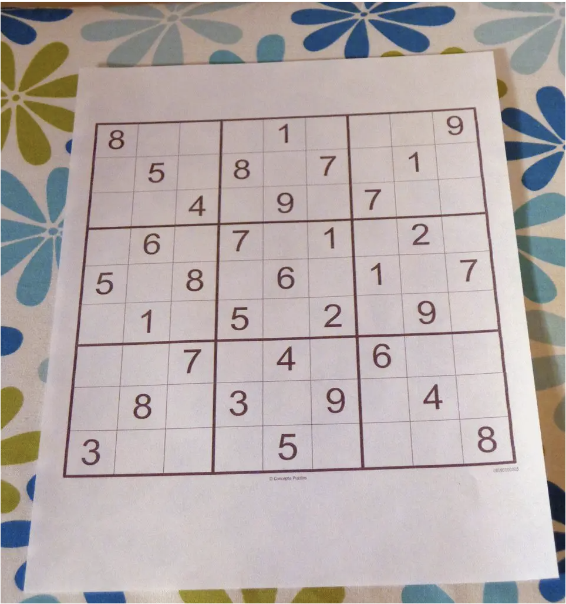
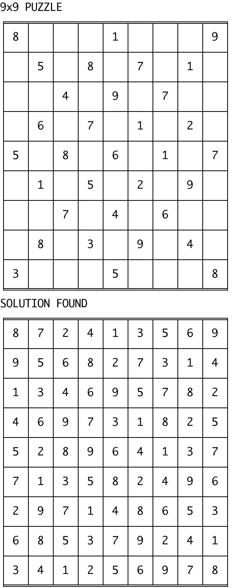
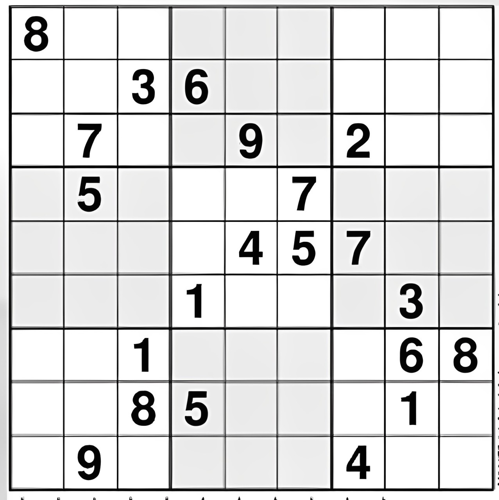
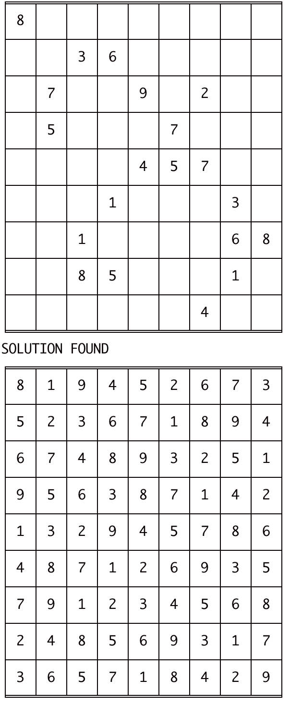
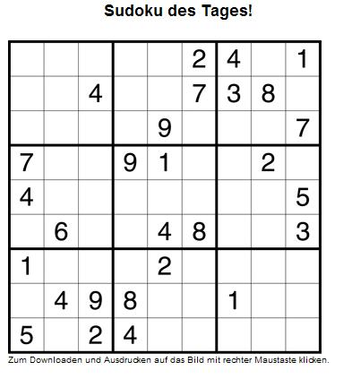
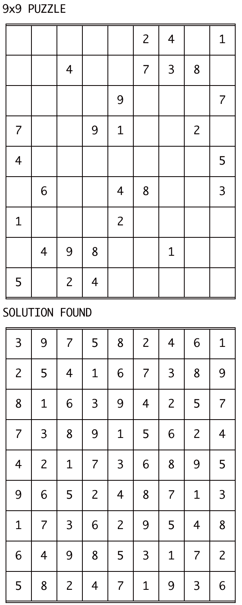
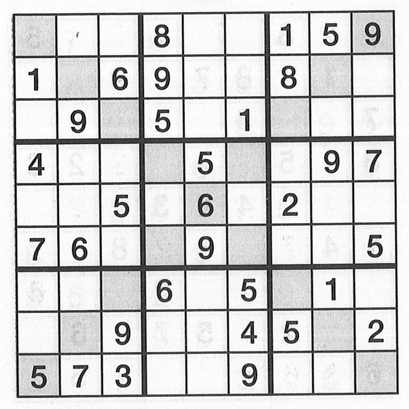
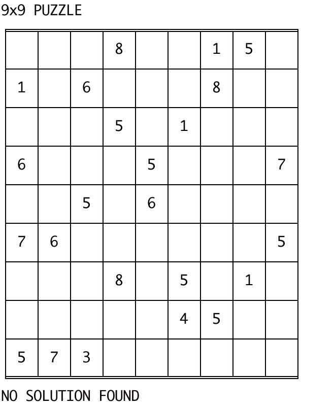

# Automated Sudoku Solver with Deep Learning for Digit Recognition

This project presents a framework for solving Sudoku puzzles from images using a hybrid approach. By combining a constraint solver with a Convolutional Neural Network (CNN) trained for digit recognition, our system efficiently extracts Sudoku grids, identifies digits, and computes solutions. [Final Project Report](./FInal%20Project%20Report.pdf)

---

## Table of Contents
- [Prerequisites](#prerequisites)
- [Installation & Usage](#installation--usage)
- [Sample](#sample)
- [Acknowledgments](#acknowledgments)

---

## Prerequisites

### System Requirements
- **Python**: Version 3.8 - 3.11
- **Pip**: Version >19.0 (or >20.3 for macOS)

### Required Libraries
Install the necessary dependencies:
```sh
pip install tensorflow numpy opencv-contrib-python scikit-image tabulate imutils scikit-learn matplotlib progressbar2 pandas seaborn
```

---

## Installation & Execution

### 1. Clone the Repository
```sh
git clone https://github.com/cmanzi00/cosc-231-final-project.git
cd cosc-231-final-project
```

### 2. Train the Model
Train the CNN model and save it with your desired name (replace `{model_name}`):
Note: The `model/output` folder contains a model  `model/output/digit_classifier_og.keras` that was trained during the project phase and has been tested on different puzzles in the `images/puzzles` folder. Feel free to use it or train a new one using the command below.
```sh
python trainer.py --model model/output/{model_name}.keras
```

### 3. Solve a Sudoku Puzzle
Provide the trained model and an image of the puzzle to be solved.
```sh
python digit_classifier.py --model model/output/{model_name}.keras --image images/puzzles/{image_name}
```
Ensure the puzzle image is stored in the `images/puzzles` folder (the `images/puzzles` folder contains some test images that can be used). Our final report uses `sudoku_small.jpg`.

---

## Sample
Visual demonstrations (e.g., screenshots, GIFs, or results).

Puzzle 1 w/ OCR version and Solution
<p align="center">
	
</p>

<p align="center">
	
</p>

Puzzle 2 w/ OCR version and Solution
<p align="center">
	
</p>

<p align="center">
	
</p>

Puzzle 3 w/ OCR version and Solution
<p align="center">
	
</p>
<p align="center">
	
</p>

Puzzle 4 w/ OCR version and Solution
<p align="center">
	
</p>
<p align="center">
	
</p>
---

## Acknowledgments
- [Grid Detection and Cell Extraction - StackOverflow](https://stackoverflow.com/questions/59182827)
- [Sudoku Images Repo](https://github.com/kirkeaton/sudoku-image-solver/tree/main/sudoku_images)
